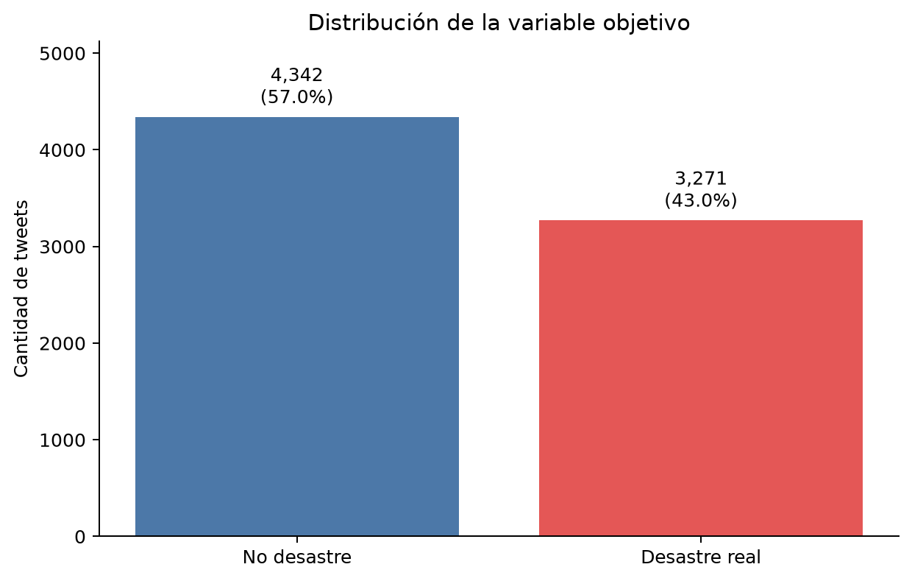
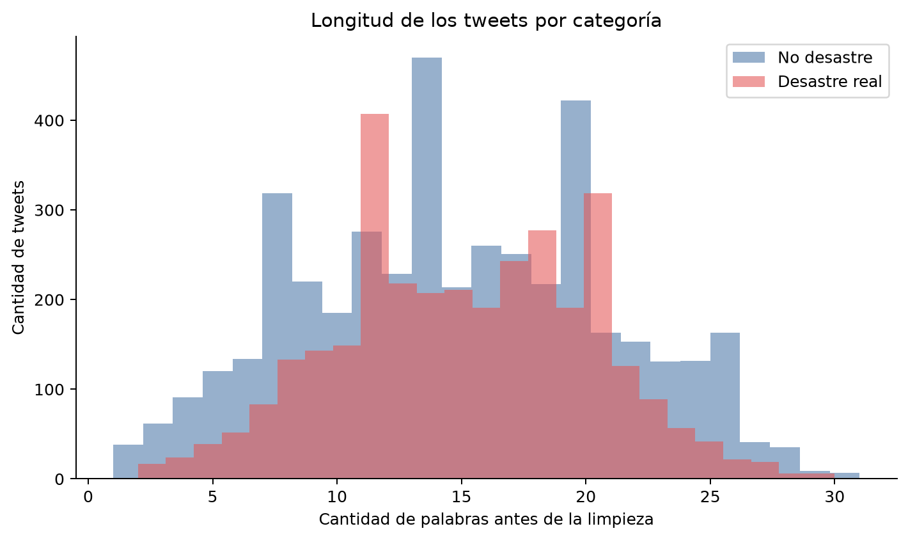
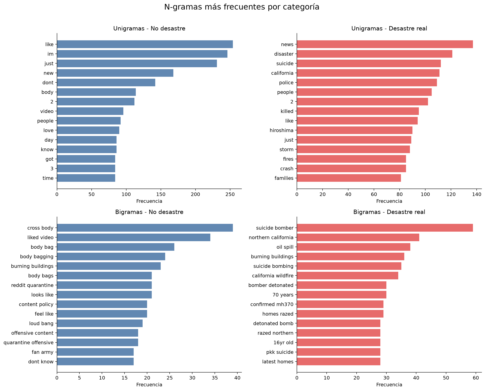
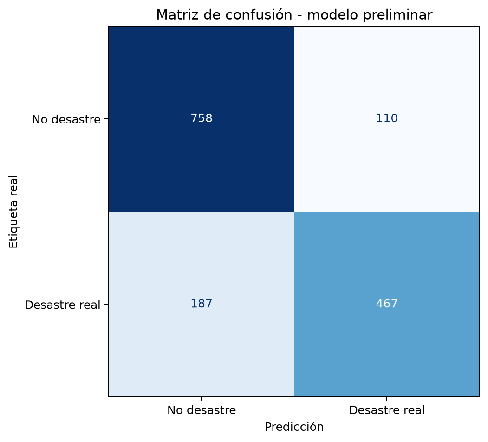

# Laboratorio 5 - Avance

## 1. Alcance

Este documento cubre únicamente lo solicitado para el avance: descripción de
los datos, preprocesamiento y sus explicaciones, frecuencias de unigramas y
bigramas, y descripción/evaluación de un modelo preliminar de clasificación.

## 2. Descripción de los datos

Se utilizó el archivo `train.csv` de la competencia
[**Natural Language Processing with Disaster Tweets**](https://www.kaggle.com/competitions/nlp-getting-started/data)
de Kaggle. La tarea consiste en predecir si
un tweet describe un desastre real (`target = 1`) o no (`target = 0`). El
conjunto contiene **7,613 filas** y cinco variables originales:

| Variable | Descripción |
| --- | --- |
| `id` | Identificador único del tweet. |
| `keyword` | Palabra clave asociada; puede estar ausente. |
| `location` | Ubicación declarada; puede estar ausente o no ser geográfica. |
| `text` | Contenido original del tweet. |
| `target` | Etiqueta binaria: 1 para desastre real y 0 para no desastre. |

Hay **4,342 tweets no relacionados con desastres
(57.03%)** y **3,271 tweets de desastres reales
(42.97%)**. La diferencia es moderada, pero se usa balanceo de
clases en el modelo preliminar. `keyword` tiene 61 valores
faltantes (0.80%) y `location` tiene
2,533 (33.27%). Ni `text` ni
`target` presentan valores faltantes.

Se encontraron **110 textos repetidos** y **18
textos únicos con etiquetas contradictorias**. No se borraron para el análisis
de frecuencias porque son observaciones reales del archivo, pero se agruparon
durante la partición del modelo para impedir que el mismo texto apareciera en
entrenamiento y prueba.



Los tweets tienen en promedio 14.90 palabras antes de
la limpieza. La figura siguiente muestra que ambas clases presentan longitudes
similares, aunque la forma de sus distribuciones no es idéntica.



## 3. Limpieza y preprocesamiento

El preprocesamiento se implementó en `src/lab5/data.py` y aplica, en orden, las
siguientes decisiones:

1. Decodificar entidades HTML y convertir el texto a minúsculas.
2. Eliminar URL completas, ya que identificadores aleatorios y dominios pueden
   crear un vocabulario grande y poco generalizable.
3. Eliminar menciones (`@usuario`) para no aprender cuentas particulares.
4. Quitar el símbolo `#`, pero conservar la palabra del hashtag; por ejemplo,
   `#ForestFire` se vuelve `forestfire` porque contiene información temática.
5. Normalizar Unicode y eliminar apóstrofes, puntuación, símbolos y emoticones.
6. Eliminar stopwords inglesas mediante la lista incluida en scikit-learn.
7. Conservar números, incluido `911`, porque pueden aportar contexto de
   emergencia. También se eliminan tokens alfabéticos de una sola letra.

Después de la limpieza quedan en promedio 8.56
tokens por tweet. **4 tweets quedan sin
tokens** tras aplicar todas las reglas y se conservan como cadenas vacías. No
se aplicó stemming ni lematización en este avance para mantener una línea base
transparente y reproducible.

## 4. Unigramas y bigramas

Las frecuencias se calcularon por separado para cada clase sobre el texto
limpio. La probabilidad empírica de cada n-grama se definió como su frecuencia
dividida entre la frecuencia total de los n-gramas de la misma longitud y
clase. Los resultados completos están en
`outputs/tables/ngram_frequencies.csv`.

### 4.1. Unigramas más frecuentes

| No desastre | Frecuencia 0 | Desastre real | Frecuencia 1 |
| --- | --- | --- | --- |
| like | 254 | news | 137 |
| im | 246 | disaster | 121 |
| just | 231 | suicide | 112 |
| new | 168 | california | 111 |
| dont | 142 | police | 109 |
| body | 114 | people | 105 |
| 2 | 112 | 2 | 102 |
| video | 96 | killed | 95 |
| people | 92 | like | 94 |
| love | 90 | hiroshima | 90 |

### 4.2. Bigramas más frecuentes

| No desastre | Frecuencia 0 | Desastre real | Frecuencia 1 |
| --- | --- | --- | --- |
| cross body | 39 | suicide bomber | 59 |
| liked video | 34 | northern california | 41 |
| body bag | 26 | oil spill | 38 |
| body bagging | 24 | burning buildings | 36 |
| burning buildings | 23 | suicide bombing | 35 |
| body bags | 21 | california wildfire | 34 |
| looks like | 21 | 70 years | 30 |
| reddit quarantine | 21 | bomber detonated | 30 |
| content policy | 20 | confirmed mh370 | 29 |
| feel like | 20 | homes razed | 29 |



Los unigramas de desastre incluyen términos directamente asociados con
eventos y consecuencias, mientras que en no desastre aparecen expresiones de
conversación general y usos figurados. Los bigramas agregan contexto local:
frases como `suicide bomber` o `northern california` son más específicas que
sus palabras por separado. Aun así, un bigrama solo observa dos tokens
adyacentes y no resuelve dependencias largas, sarcasmo ni negación compleja.

## 5. Modelo preliminar de clasificación

Se entrenó una **regresión logística** con `class_weight='balanced'`. La entrada
es una matriz **TF-IDF de unigramas y bigramas**, con términos presentes en al
menos dos tweets (`min_df=2`) y descartando los que aparecen en más del 95% de
los documentos (`max_df=0.95`). Los bigramas representan una primera
aproximación al contexto; el modelo sigue siendo lineal e interpretable.

La evaluación usa una partición aproximada 80/20 mediante
`StratifiedGroupKFold` con semilla 42. La estratificación conserva la proporción
de clases y el agrupamiento por `text_clean` evita fuga de textos duplicados.
Se usaron **6,091 tweets para entrenamiento** y
**1,522 para prueba** (19.99%).

| Métrica | Resultado |
| --- | ---: |
| Exactitud | 0.8049 |
| Precisión (desastre) | 0.8094 |
| Recall (desastre) | 0.7141 |
| F1 (desastre) | 0.7587 |
| ROC AUC | 0.8621 |



El F1 es la métrica principal porque combina precisión y recall para la clase
de desastre, y coincide con la evaluación de la competencia. Estos resultados
son una línea base de una sola partición, no la selección definitiva del mejor
modelo. En el informe final deberán compararse algoritmos, realizar validación
más amplia y analizar errores.

## 6. Elementos fuera de este avance

Para respetar el alcance de la primera entrega, todavía no se incluyen el
análisis de sentimiento, los diez tweets más positivos/negativos, la variable
de negatividad, la función para clasificar tweets nuevos ni la selección final
entre varios modelos.

## 7. Referencias

- Kaggle. [Natural Language Processing with Disaster Tweets](https://www.kaggle.com/competitions/nlp-getting-started).
- Scikit-learn. [TfidfVectorizer](https://scikit-learn.org/stable/modules/generated/sklearn.feature_extraction.text.TfidfVectorizer.html).
- Scikit-learn. [LogisticRegression](https://scikit-learn.org/stable/modules/generated/sklearn.linear_model.LogisticRegression.html).
- Scikit-learn. [StratifiedGroupKFold](https://scikit-learn.org/stable/modules/generated/sklearn.model_selection.StratifiedGroupKFold.html).

## 8. Reproducibilidad

```powershell
python -m pip install -r requirements.txt
python scripts/download_data.py
python scripts/run_advance.py
python -m unittest discover -s tests -v
```
